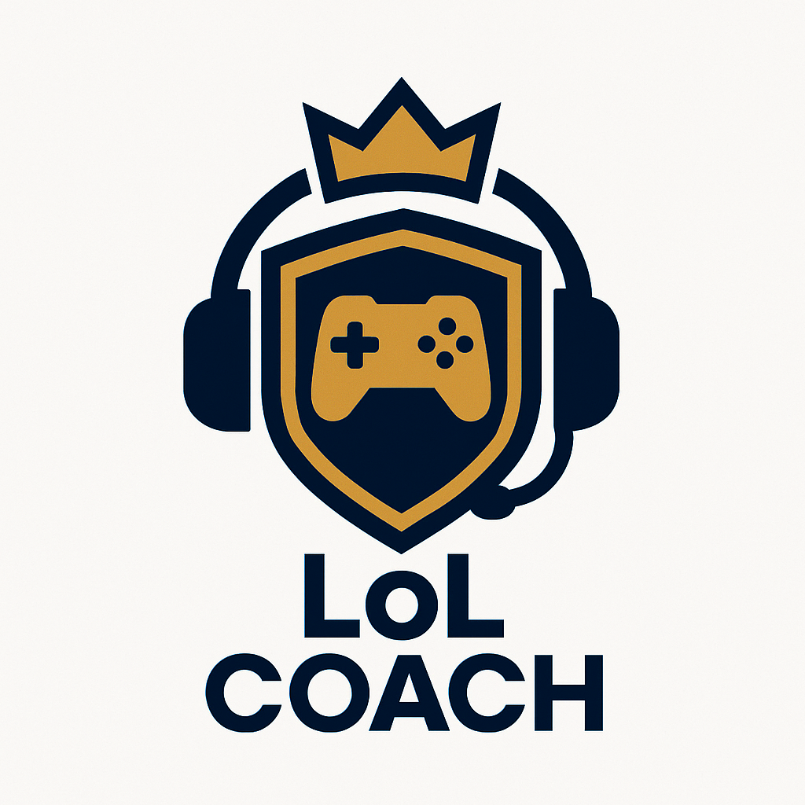

# Pro Coach Virtual - League of Legends AI Coach

<div align="center">



**Seu treinador virtual de LoL com IA para te ajudar a subir de elo**

[](https://discord.com/api/oauth2/authorize?client_id=1424883890505384069&permissions=37014608&scope=bot%20applications.commands)
[](LICENSE)
[](https://www.python.org/)
[](https://reactjs.org/)

</div>

---

## 📋 Sobre o Projeto

O **Pro Coach Virtual** é um sistema completo de coaching para League of Legends que utiliza Inteligência Artificial para fornecer dicas e análises em tempo real durante suas partidas. O sistema é composto por:

- 🤖 **Bot Discord** - Fornece coaching por voz em tempo real
- 💻 **Cliente Local** - Captura dados das partidas via Live Client Data API
- 🌐 **Website** - Sistema de autenticação e gerenciamento de assinaturas
- 🔐 **Backend API** - Gerenciamento de usuários e pagamentos

## ✨ Funcionalidades

### Coaching em Tempo Real
- Dicas de build e itens durante a partida
- Análise de matchups e estratégias de lane
- Alertas de objetivos e timings importantes
- Sugestões de posicionamento e rotações

### Análise Pós-Partida
- Estatísticas detalhadas de desempenho
- Comparação com jogadores de elo superior
- Identificação de pontos de melhoria
- Relatórios completos em PDF

### Interação Natural
- Voz natural e não-robotizada (OpenAI TTS)
- Responde perguntas durante a partida
- Coaching personalizado para cada rota
- Suporte para coaching em equipe

## 🚀 Como Funciona

1. **Assine um Plano** - Acesse o site e escolha seu plano de assinatura
2. **Convide o Bot** - Adicione o Pro Coach Virtual ao seu servidor Discord
3. **Baixe o Cliente** - Instale o cliente local no seu computador
4. **Jogue e Aprenda** - Entre em um canal de voz e inicie uma partida!

## 🛠️ Tecnologias Utilizadas

### Backend
- **Flask** - Framework web Python
- **SQLAlchemy** - ORM para banco de dados
- **JWT** - Autenticação segura
- **PostgreSQL** - Banco de dados em produção
- **Gunicorn** - Servidor WSGI

### Frontend
- **React 18** - Biblioteca UI
- **Vite** - Build tool
- **Tailwind CSS** - Framework CSS
- **shadcn/ui** - Componentes UI
- **Lucide Icons** - Ícones

### Bot Discord
- **Discord.py** - Biblioteca Discord
- **OpenAI API** - Text-to-Speech natural
- **Riot Games API** - Dados do jogo
- **WebSocket** - Comunicação em tempo real

### Cliente Local
- **Python** - Linguagem principal
- **Requests** - HTTP client
- **PyInstaller** - Criação de executável
- **Pystray** - Ícone na bandeja do sistema

## 📦 Estrutura do Projeto

```
procoachvirtual/
├── lol-coach-backend/          # API Flask
│   ├── app.py                  # Aplicação principal
│   ├── payments.py             # Sistema de pagamentos
│   ├── requirements.txt        # Dependências Python
│   └── .env.example            # Exemplo de variáveis de ambiente
├── lol-coach-frontend/         # Website React
│   ├── src/
│   │   ├── App.jsx             # Componente principal
│   │   └── App.css             # Estilos
│   ├── public/                 # Assets estáticos
│   └── package.json            # Dependências Node.js
├── bot/                        # Bot Discord (mover de lol_coach_bot/)
│   ├── discord_bot_cloud.py    # Bot para produção
│   ├── analysis_and_tips_module_cloud.py
│   ├── data_capture_module.py
│   └── requirements.txt
├── client/                     # Cliente Local (mover de lol_coach_client/)
│   ├── local_client_with_tray.py
│   ├── requirements.txt
│   └── build.py                # Script de build
├── docs/                       # Documentação
│   ├── DEPLOY_GUIDE.md
│   └── COMPLIANCE_AND_SECURITY.md
└── README.md                   # Este arquivo
```

## 🔧 Instalação e Configuração

### Pré-requisitos

- Python 3.11+
- Node.js 18+
- PostgreSQL 14+ (produção)
- Conta Discord Developer
- Chave API da Riot Games
- Chave API da OpenAI

### Backend

```bash
cd lol-coach-backend

# Criar ambiente virtual
python -m venv venv
source venv/bin/activate  # Linux/Mac
# ou
venv\Scripts\activate  # Windows

# Instalar dependências
pip install -r requirements.txt

# Configurar variáveis de ambiente
cp .env.example .env
# Edite o .env com suas chaves

# Iniciar servidor
python app.py
```

### Frontend

```bash
cd lol-coach-frontend

# Instalar dependências
npm install
# ou
pnpm install

# Iniciar servidor de desenvolvimento
npm run dev
```

### Bot Discord

```bash
cd bot

# Criar ambiente virtual
python -m venv venv
source venv/bin/activate

# Instalar dependências
pip install -r requirements.txt

# Configurar variáveis de ambiente
export DISCORD_BOT_TOKEN="seu_token_aqui"
export OPENAI_API_KEY="sua_chave_aqui"

# Iniciar bot
python discord_bot_cloud.py
```

### Cliente Local

```bash
cd client

# Instalar dependências
pip install -r requirements.txt

# Executar cliente
python local_client_with_tray.py

# Ou criar executável
python build.py
```

## 🌐 Deploy

### Backend (Render)

1. Crie um novo Web Service no [Render](https://render.com)
2. Conecte seu repositório GitHub
3. Configure as variáveis de ambiente
4. Deploy automático a cada push

### Frontend (Vercel)

1. Importe o projeto no [Vercel](https://vercel.com)
2. Configure o diretório raiz como `lol-coach-frontend`
3. Deploy automático a cada push

### Bot (VPS/Railway)

1. Configure um servidor VPS ou use [Railway](https://railway.app)
2. Clone o repositório
3. Configure as variáveis de ambiente
4. Execute o bot com PM2 ou similar

Consulte [DEPLOY_GUIDE.md](docs/DEPLOY_GUIDE.md) para instruções detalhadas.

## 🔐 Segurança e Conformidade

O Pro Coach Virtual foi desenvolvido seguindo as melhores práticas de segurança e em total conformidade com as políticas da Riot Games:

- ✅ **Não modifica o cliente do jogo**
- ✅ **Não lê memória do processo**
- ✅ **Usa apenas APIs públicas da Riot**
- ✅ **Compatível com o Riot Vanguard**
- ✅ **Similar ao Blitz.gg e OP.GG**

Consulte [COMPLIANCE_AND_SECURITY.md](docs/COMPLIANCE_AND_SECURITY.md) para mais detalhes.

## 💳 Planos e Preços

### Mensal
- **R$ 29,90/mês**
- Todos os recursos incluídos
- Cancele quando quiser

### Trimestral
- **R$ 80,73** (R$ 26,91/mês)
- Economize 10%
- Todos os recursos incluídos

### Anual
- **R$ 287,04** (R$ 23,92/mês)
- Economize 20%
- Todos os recursos incluídos

## 🤝 Contribuindo

Contribuições são bem-vindas! Por favor, siga estas etapas:

1. Fork o projeto
2. Crie uma branch para sua feature (`git checkout -b feature/AmazingFeature`)
3. Commit suas mudanças (`git commit -m 'Add some AmazingFeature'`)
4. Push para a branch (`git push origin feature/AmazingFeature`)
5. Abra um Pull Request

## 📝 Licença

Este projeto está sob a licença MIT. Veja o arquivo [LICENSE](LICENSE) para mais detalhes.

## ⚠️ Aviso Legal

Pro Coach Virtual não é endossado pela Riot Games e não reflete as opiniões ou visões da Riot Games ou de qualquer pessoa oficialmente envolvida na produção ou gerenciamento de League of Legends. League of Legends e Riot Games são marcas registradas ou marcas comerciais da Riot Games, Inc. League of Legends © Riot Games, Inc.

## 📧 Contato

- **Website**: [procoachvirtual.com](https://procoachvirtual.com)
- **Discord**: [Servidor de Suporte](https://discord.gg/procoachvirtual)
- **Email**: suporte@procoachvirtual.com

---

<div align="center">

**Desenvolvido com ❤️ para a comunidade de League of Legends**

</div>
